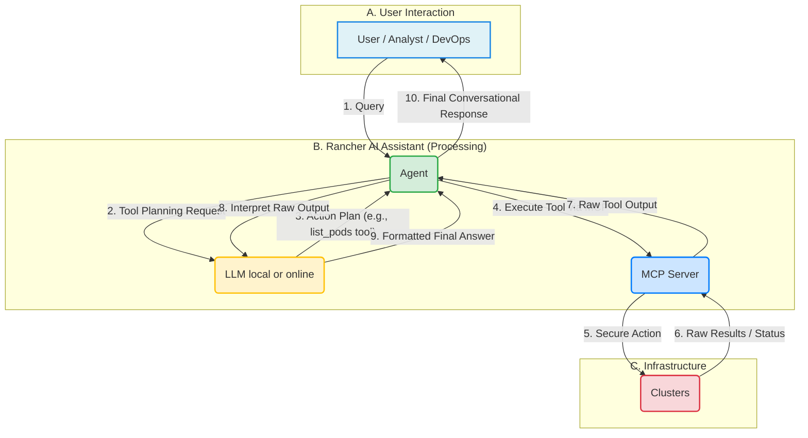

> :warning: Warning! This project is in its very early stages of development. Expect frequent changes and potential breaking updates as we iterate on features and architecture.

# AI Assistant for Rancher

## Architecture

The system is composed of a **UI Extension** for user interaction, a **ReAct Agent** for intelligent decision-making, and an **MCP Server** that acts as the intermediary between the agent and the Rancher API. 

### [ReAct Agent](https://github.com/rancher-sandbox/rancher-ai-agent)

The **ReAct Agent** is the orchestrator of the system’s intelligence. It leverages a **Large Language Model (LLM)** as its **reasoning engine**, while the agent itself provides the structure, coordination, and secure execution of actions.

#### 🧠 LLM (Reasoning Engine)
- Interprets user inputs expressed in natural language.  
- Performs the **reasoning**: breaks down complex requests into smaller steps.  
- Decides what should happen next (keep reasoning vs. take action).  
- Synthesizes outputs from tools into clear, human-readable responses.  

#### ⚙️ Agent (Orchestrator)
- Wraps the LLM with the **ReAct (Reason + Act)**
- Decides when to let the LLM keep reasoning or when to **act** on its instructions.  
- Calls external tools (via the MCP Server) as directed by the LLM.  
- Ensures secure interactions by passing the user’s Rancher token to the MCP server for authentication and authorization.  

#### [MCP Server](https://github.com/rancher-sandbox/rancher-ai-mcp)

The **MCP Server** acts as a secure, controlled gateway between the ReAct Agent and the Rancher and Kubernetes APIs. Its functions include:

  * **Exposing Tools**: It provides a set of well-defined, safe tools (API endpoints) that the ReAct Agent can call. These tools abstract away the complexity of direct Rancher/Kubernetes API interactions.
  * **Interaction with Rancher**: It translates tool calls from the agent into the appropriate API requests to the Rancher management server, retrieving or modifying resources as needed.

### UI Extension

The **UI Extension** provides the user-facing chat interface within the Rancher dashboard. It is designed to be a seamless part of the Rancher experience and is responsible for:

  * **User Input**: It captures user queries and sends them to the ReAct Agent.
  * **Displaying Responses**: It receives responses from the ReAct Agent and presents them in a chat-like format.

## How It Works (Flow)

1. **User Request → Agent → LLM**  
   The user submits a natural language query through the UI Extension.  
2. **LLM Reasoning**  
   The LLM interprets the request, reasons about the problem, and proposes a plan.  
3. **Agent Acting**  
   If the plan requires external operations, the agent calls the appropriate MCP Server tools.  
4. **LLM Response Formulation**  
   The LLM takes the tool outputs and crafts a coherent, human-readable response.  
5. **Response → User**  
   The answer is returned to the user through the UI Extension.


## Installation Steps

1. Add the Helm Repository
First, add the Rancher AI Agent Helm repository to your cluster.

```bash
helm repo add rancher-ai https://rancher.github.io/rancher-ai-agent
```

2. Update Your Helm Repositories
Fetch the latest list of charts from all your configured repositories.

```bash
helm repo update
```

3. Install the Chart
Install the agent chart into a new namespace using the values.yaml file you created.

```bash
helm install rancher-ai-agent rancher-ai/agent \
  --namespace cattle-ai-agent-system \
  --create-namespace \
  --devel \
  -f values.yaml
--create-namespace
```

--devel: Includes pre-release versions of the chart, which is currently required.

-f values.yaml: Applies your custom LLM configuration.

## Accessing the UI
Once the agent is installed, you need to install the UI extension

## Chat History
The AI Assistant maintains persistent chat history with REST API endpoints for accessing and managing conversations:
- `GET /api/chats` - List all chat sessions
- `GET /api/chats/{id}/messages` - Retrieve all messages for a specific chat session
- `DELETE /api/chats/{id}` - Delete a specific chat session

See the [OpenAPI spec](openapi.yaml) for full API details.

## RBAC

To use the AI agent a user needs get permission to the 'llm-config' secret and the 'http:rancher-ai-agent:80' services/proxy.

NOTE: This is a temporary solution.
The following GlobalRole can be used to grant permissions to use the AI Agent:

```
apiVersion: management.cattle.io/v3
displayName: ai
kind: GlobalRole
metadata:
  name: ai-agent
namespacedRules:
  cattle-ai-agent-system:
    - apiGroups:
        - ''
      resourceNames:
        - http:rancher-ai-agent:80
      resources:
        - services/proxy
      verbs:
        - get
    - apiGroups:
        - ''
      resourceNames:
        - llm-config
      resources:
        - secrets
      verbs:
        - get
```


